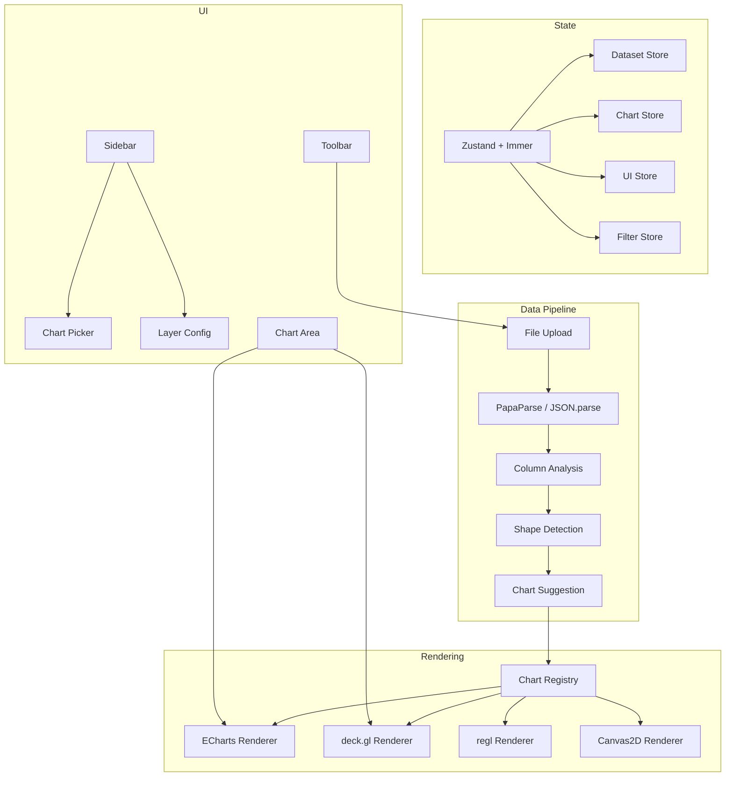

# Business Intelligence — Universal Charting Platform

The ultimate universal charting and data analysis platform — a single tool that can visualize and analyze any dataset from any domain. Upload tabular data, the app auto-detects the data shape, suggests appropriate chart types, and provides interactive analysis.

## Architecture



## Target Scale

- **193 chart types** across 13 families (distribution, categorical, time series, relationships, matrix/grid, hierarchical, network/flow, geographic, finance, statistical/model eval, composition, specialized, 3D)
- **3 of 193 implemented** (histogram, line, scatter)
- Architecture complete: registry, renderer base classes, data pipeline, shape detection, theming

## Tech Stack

| Layer | Technology |
|-------|-----------|
| UI Framework | React 19 + TypeScript |
| Build | Vite |
| Charts (~120 types) | Apache ECharts 6 (Canvas/WebGL) |
| Large data / geo / 3D (~40 types) | deck.gl 9 (WebGL-native) |
| Custom shaders | regl |
| State | Zustand + Immer |
| Styling | Tailwind CSS v4 |
| UI Primitives | Radix UI |
| CSV Parsing | PapaParse |
| Layouts/Computation | D3 (force, hierarchy) |
| Deployment | Docker + nginx |

## Chart Families

| Family | Target Count | Examples |
|--------|-------------|----------|
| Distribution | 15 | Histogram, KDE, violin, box plot, ridgeline |
| Categorical | 18 | Bar, grouped bar, Pareto, lollipop, waffle |
| Time Series | 16 | Line, area, candlestick, sparkline, horizon |
| Relationships | 14 | Scatter, hexbin, bubble, pair plot, correlogram |
| Matrix/Grid | 12 | Heatmap, calendar, mosaic, pixel map |
| Hierarchical | 10 | Treemap, sunburst, dendrogram, icicle |
| Network/Flow | 15 | Sankey, chord, force graph, arc diagram |
| Geographic | 18 | Choropleth, dot map, flow map, globe |
| Finance | 12 | Candlestick, waterfall, funnel, bullet |
| Statistical | 15 | ROC, confusion matrix, residual, QQ plot |
| Composition | 12 | Pie, donut, stacked bar, Marimekko |
| Specialized | 20 | Radar, gauge, word cloud, timeline |
| 3D | 16 | Surface, scatter3D, bar3D, globe |

## Running

### Docker (recommended)
```bash
# macOS/Linux
./bi_service.sh

# Windows
bi_service.bat
```

### Local Development
```bash
npm run dev      # dev server with hot reload
npm run build    # production build
npx tsc --noEmit # type check
```

## Adding Charts

Use `/new-chart` or `/scaffold-charts` commands to rapidly add chart types. Each chart is a self-contained file under `src/charts/families/{family}/` that registers itself via the chart registry.

See [CHARTS.md](CHARTS.md) for the full chart catalog with data shape requirements and auto-detection rules.

## Project Structure

```
src/
  app/App.tsx            → Root component
  charts/
    registry.ts          → ChartRegistry singleton
    types.ts             → ChartDefinition, ChartRenderer interfaces
    renderers/           → Base renderer classes (ECharts, deck.gl, regl)
    families/            → One dir per family, one file per chart type
  data/
    loader.ts            → File upload → parser dispatch
    shape-detector.ts    → Column analysis → DataShape detection
    chart-suggester.ts   → DataShape → ranked suggestions
    transforms.ts        → Filter, sort, aggregate
  stores/                → Zustand stores (dataset, chart, ui, filter)
  components/            → Toolbar, Sidebar, ChartArea
  theme/                 → Dark/light tokens + provider
  types/                 → DataSet, ColumnMeta, DataShape, Filter
```