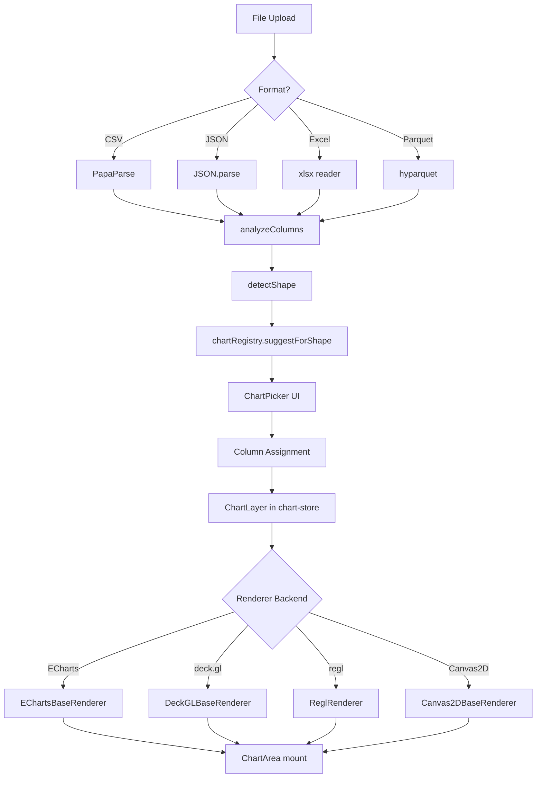
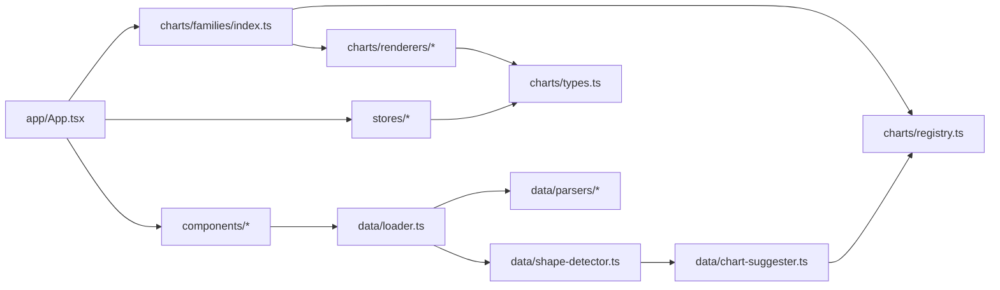
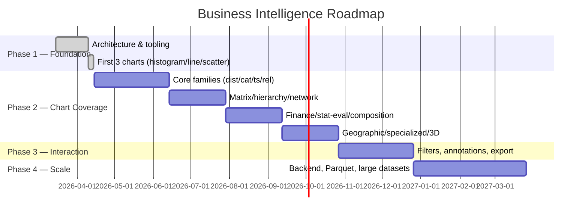

# Business Intelligence — Master Plan

**Status:** First draft (2026-04-14); current implementation status updated 2026-06-04. Authoritative source for goals, phases, architecture decisions, and gate criteria. Re-read at the start of any non-trivial task. If a request conflicts with this document, stop and flag it before proceeding.

**Related documents:**
- [CLAUDE.md](../CLAUDE.md) — project-level AI guidelines, tech stack, patterns
- [CHARTS.md](../CHARTS.md) — full chart catalog (193 types across 13 families), data shapes, auto-detection rules
- [docs/status.md](status.md) — live state snapshot
- [docs/versions.md](versions.md) — semver changelog

---

## 1. Goal

Build the single universal charting and data analysis platform that can visualize and analyze **any tabular dataset from any domain** with **any of 193 chart types across 13 families**. Designed to be reused across every project I build — drop in a dataset, get the right chart suggestions, interact, annotate, export.

### Motivation

Every project I work on eventually needs charts. Every time I reach for a new library (Chart.js here, Plotly there, d3 by hand elsewhere), I re-solve the same problems: file upload, shape detection, chart selection, theming, responsive rendering, large-data performance. This project centralizes that work once, well, with the right WebGL-capable stack — so every future project imports or embeds this tool rather than rebuilding a chart layer from scratch.

### Non-goals

- Not a BI dashboard product (no auth, no multi-tenant, no scheduled reports).
- Not a data warehouse or ETL tool — data comes in as files.
- Not a notebook (Jupyter/Observable) — this is a focused app, not a computation environment.
- No backend this phase. Pure client-side app. A backend may come later if/when datasets exceed browser memory.

---

## 2. Architecture

### Module dependencies

### Key architectural decisions

| Decision | Choice | Reason |
|---|---|---|
| Rendering backends | ECharts + deck.gl + regl + Canvas2D | ECharts covers ~120 standard chart types with Canvas/WebGL. deck.gl is WebGL-native for large data, geo, 3D (~40 charts). regl for bespoke shaders. Canvas2D as simple fallback. Each chart picks one — canvases are not shared. |
| State management | Zustand + Immer | Lightweight, minimal boilerplate, works with React 19. One store per concern (dataset, chart, ui, filter, annotation). |
| Chart definition | Registry singleton + side-effect imports | Each chart is a `ChartDefinition` registered via `chartRegistry.register(...)`. Family `index.ts` imports the chart files for their side effects; top-level `families/index.ts` is the single barrel. Enables code splitting per family. |
| Data-shape-driven UX | `DataShape` enum → ranked chart suggestions | User uploads data; we detect shape; registry returns compatible charts sorted by fit. Eliminates the "which chart?" paralysis. |
| Styling | Tailwind CSS v4 + CSS custom properties for theme | Utility-first speed. Theme tokens in `theme/tokens.ts` driven through CSS variables for runtime dark/light switching without re-render cascades. |
| Client-only (no backend) | Phase 1–3 | Browser-parseable data sizes are sufficient for the target audience this phase. Backend considered for Phase 4+ when datasets cross memory limits. |

### Data contracts (sacred — see global CLAUDE.md §7)

- `DataSet` — loaded dataset with rows, columns, and `ColumnMeta[]`; loaders currently cover CSV/TSV, JSON, Excel `.xlsx`/`.xlsm`, and Parquet `.parquet`.
- `ColumnMeta` — per-column type/stats/distribution
- `DataShape` — enum of detected shapes (see CHARTS.md for full list)
- `ChartDefinition` — metadata + `createRenderer()` factory; carries an optional declarative `options?: ChartOptionSpec[]` (added M1, 2026-06-03 — additive/backward-compatible, minor bump) that `ChartOptionsPanel` renders generically
- `ChartOptionSpec` (`src/charts/option-spec.ts`) — one tunable option control `{ key, label, control: 'number'|'toggle'|'select'|'color', default, … }`; `resolveOptions` applies defaults as the single source of truth
- `ChartRenderer` — `render(data, config, theme) → ReactElement`; Canvas2D support is implemented through `Canvas2DBaseRenderer` + `Canvas2DChart` (M5 slice 1, 2026-06-04), deck.gl support includes Map/Orbit/Orthographic view selection plus data-driven initial view state hooks in `DeckGLBaseRenderer`/`DeckGLChart` (M5 slice 2, 2026-06-04), and regl support is implemented through `ReglBaseRenderer` + `ReglChart` (post-completion renderer-infrastructure polish, 2026-06-04). These are additive renderer-infrastructure extensions that do not change this interface.
- `ChartConfig` — per-layer column assignments + options
- `Filter` — predicate applied pre-render

Changing any of these in a **breaking** way is a major semver bump. Flag before making the change. Additive, backward-compatible extensions (e.g. the optional `options` field above) are a minor bump and must be documented here and in `docs/versions.md`.

---

## 3. Phases

### Phase 1 — Foundation (COMPLETE)

**Scope:** Ship the skeleton end-to-end so adding the next 190 charts is purely additive.

Deliverables:
- Chart registry + renderer base classes (ECharts, deck.gl, regl, Canvas2D)
- Data pipeline: upload → parse → column analysis → shape detection → chart suggestion
- Zustand stores (dataset, chart, ui, filter, annotation)
- Dark/light theme via CSS custom properties
- Docker (multi-stage node + nginx) + launcher scripts
- 3 reference charts: histogram, line, scatter (one per core family, ECharts backend)
- CLAUDE.md + CHARTS.md + `.claude/` skills and commands

**Gate:** ✅ User can upload a CSV, see shape detected, pick one of three working chart types, and render it in dark or light mode.

### Phase 2 — Chart Coverage

**Scope:** Implement the remaining 190 chart types across 13 families. Zero new architecture — every chart is a file in `charts/families/<family>/<chart>.ts` registered via side-effect import.

**Current status (2026-06-04):** locally complete at **193/193** registered charts. Every registered chart has unit coverage and a Gate-3 Playwright visual-gate mapping/baseline path; final formal closeout still requires committing/pushing and confirming the GitHub Actions pipeline green on `main`.

Sub-phases (rough ordering, not strict):
1. **Core families** (distribution, categorical, time-series, relationships) — ~80 charts. ECharts-heavy. Highest user value.
2. **Matrix, hierarchy, network/flow** — ~30 charts. Mix of ECharts and deck.gl (for large graphs).
3. **Finance, statistical/model-eval, composition** — ~45 charts. ECharts for most; regl for specialized (volume rendering, custom shaders).
4. **Geographic, specialized, 3D** — ~38 charts. deck.gl-heavy for geo and 3D; regl for niche.

Deliverable per chart: one file, registered, rendered, type-checked, at least one test with a representative dataset.

**Gate:** all 193 charts registered; `/chart-status` reports 193/193; each chart renders correctly with a representative sample dataset; no chart throws on its documented minimum-column shape.

### Phase 3 — Interaction & UX polish

**Scope:** Move from "renders charts" to "is usable for real analysis."

Deliverables:
- Filter UI driving `filter-store` — range, category, text, compound predicates
- Annotations persisted per dataset (point/region/text) via `annotation-store`
- Multi-layer compositing (overlay two charts sharing an axis)
- Small multiples / faceting UI
- Export: PNG, SVG where supported, CSV of current view, chart spec JSON
- Keyboard shortcuts and command palette
- Responsive layout for smaller viewports

**Gate:** a user can load a dataset, filter it, compose two layers, annotate a point, and export both the chart image and the filtered data.

### Phase 4 — Scale (backend)

**Scope:** Handle datasets that don't fit in browser memory.

Deliverables:
- FastAPI backend (global stack §5) for ingestion, column stats, sampling, aggregations, tile serving
- Postgres for metadata; DuckDB/Parquet for columnar query
- Binary WebSocket streaming (MessagePack) for large numeric payloads
- Client-side shifts from "load all rows" to "request views"
- docker-compose gains backend + postgres services with healthchecks and `depends_on: service_healthy`

**Gate:** 10M-row Parquet file renders a histogram, scatter (hexbinned), and time-series line in under 2s perceived latency on a dev laptop.

---

## 4. Cross-phase concerns

### Performance budgets

| Data size | Phase 1–3 target | Phase 4 target |
|---|---|---|
| ≤ 10k rows | 60fps interaction, <200ms initial render | same |
| 10k–100k rows | 30fps interaction, <500ms render | 60fps, <200ms |
| 100k–1M rows | Best-effort via ECharts/deck.gl; hexbin/density fallbacks | 60fps, <500ms |
| 1M+ rows | Not supported | Backend-assisted, streamed tiles |

### Canonical types

`src/charts/types.ts` and `src/types/data.ts` are the source of truth for every cross-module contract. Never duplicate a type locally — import from there.

### Naming

Per global CLAUDE.md §5: chart files are `snake_case.ts` (`grouped_bar.ts`, `correlation_heatmap.ts`) matching the chart name in CHARTS.md, normalized to snake_case.

### Testing

- Unit tests for every shape-detector branch, suggester rule, and data transform
- Per-chart smoke test: given a representative fixture, `createRenderer().render(...)` returns a ReactElement without throwing
- Coverage target 100% per global CLAUDE.md §7 (enforced in CI once CI is wired up)

### Reuse discipline

Before adding a new helper (axis formatter, color scale, tooltip builder, etc.), grep the codebase. Hundreds of charts will share utilities — duplication compounds fast.

---

## 5. Definition of done (Phase 2, representative)

A chart type is done when:

1. File exists at `src/charts/families/<family>/<chart>.ts` with one `ChartDefinition`.
2. Registered via `chartRegistry.register(...)`.
3. Imported in the family's `index.ts` (side-effect import).
4. Extends the correct base renderer (ECharts / deck.gl / regl / Canvas2D).
5. Compatible `DataShape`s declared — matches CHARTS.md "Minimum columns / structure" column.
6. `npx tsc --noEmit` clean.
7. `npm run build` clean.
8. Smoke test with representative fixture passes.
9. Renders correctly in both dark and light theme.
10. `/chart-status` count increments by one.
11. No hard-coded colors — theme tokens only.
12. `docs/status.md` and `docs/versions.md` updated per global CLAUDE.md §6.

---

## 6. Open questions

- **Large-dataset Parquet scale** — client-side `.parquet` import is implemented with `hyparquet`; Phase 4 still needs the backend-assisted DuckDB/Parquet path for files that exceed browser memory. Legacy binary `.xls` remains out of scope until explicitly chosen.
- **Geo basemaps** — all current geographic charts render pure deck.gl layers without a basemap; decide MapLibre vs pure deck.gl tile layers before adding richer real-world polygon/tile data sources.
- **3D interaction UX** — current 3D charts use deck.gl OrbitView controls only; decide on gizmos/slicing/clipping only if future richer 3D analysis requires them.
- **Chart spec serialization format** — internal JSON shape for save/load of chart configs. Design before Phase 3 export work.
- **Backend vs pure client forever** — reassess the Phase 4 trigger once we see real dataset sizes in practice.

---

## 7. Closing reminder

This document, `CLAUDE.md`, `CHARTS.md`, `docs/status.md`, and `docs/versions.md` are the five files to read before any non-trivial change. If this document disagrees with reality (code shipped, phase advanced, decisions revised), update the document before proceeding.
