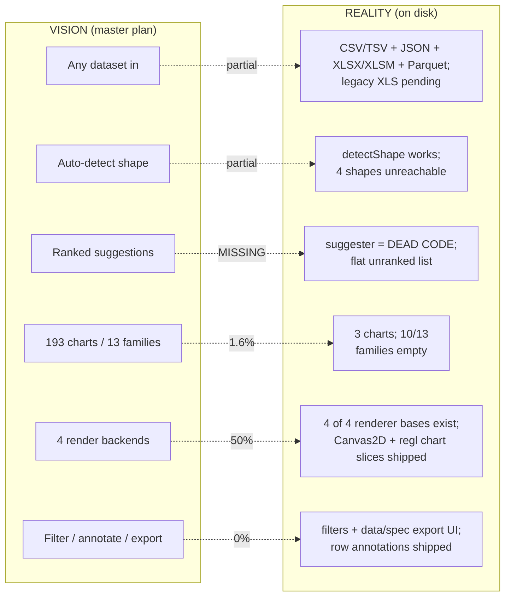
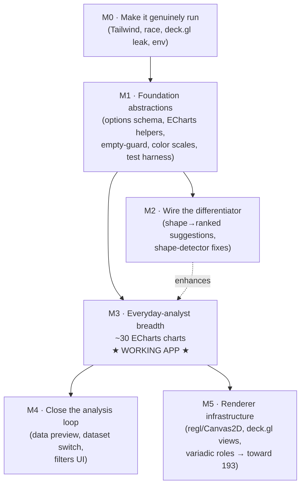
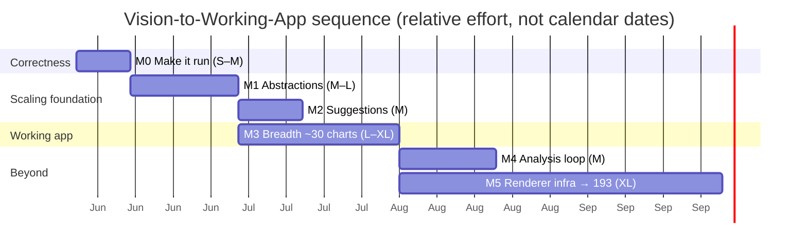

# Execution Roadmap — Vision to Working App

**Created:** 2026-06-03 · **Source:** comprehensive multi-agent codebase audit (11 agents: 7-dimension recon + empirical verification + synthesis + adversarial critique).
**Companion to:** [`BUSINESS_INTELLIGENCE_MASTER_PLAN.md`](BUSINESS_INTELLIGENCE_MASTER_PLAN.md) (the *vision*). This doc is the *operational sequence* that gets there.

**Current status (2026-06-04):** M0–M5 chart-coverage work is complete at **193/193** registered charts. Phase 2 is formally closed out on `main` at `125061d5`: GitHub Actions run #5 passed lint, typecheck, test+coverage, build, Docker build, and the 193-chart Playwright visual-regression gate. Older audit findings below are retained as historical rationale unless a later section explicitly marks them resolved.

> The master plan describes the destination. This roadmap is the ordered, audit-driven path — what is actually true on disk today, what "working app" concretely means, and the milestones (M0–M5) that reach it without accumulating rework.

---

## 1. Empirical verification — claims vs. reality

All commands run on this Windows machine on 2026-06-03 **after** a clean `npm ci` (the shipped `node_modules` was a stale macOS-ARM copy and would not run on Windows).

| Check | Docs claim | Verified result | Verdict |
|---|---|---|---|
| `npm run typecheck` (`tsc -b`) | strict, clean | **Exit 0 — clean.** `src/**` has zero type errors | ✅ holds |
| `npm run lint` (`eslint .`) | clean | **Exit 0 — clean** | ✅ holds |
| `npm run test:coverage` | 191 tests, 100% all metrics | **191 passed / 31 files; 100% stmts/branches/funcs/lines** | ✅ holds |
| `npm run build` | builds, chunk-size warning | **Exit 0**, but a single **1,374 kB** JS chunk (gzip 448 kB) | ⚠️ builds, but see below |
| Local dev runs out of the box | implied | **No** — `node_modules` was macOS-ARM; needed `npm ci` | ❌ broken until reinstall |
| App renders styled | implied | **No** — Tailwind v4 build plugin missing; utilities never generated | ❌ **app is unstyled** |
| `package.json` version | docs describe v0.3.0 | file says `0.2.0` (release pipeline bumps) | ℹ️ expected drift |
| Dependencies clean | — | **0 vulnerabilities** after M4 dependency cleanup slice 7 (`npm audit`) | ✅ |

**Bottom line:** the *foundation is genuinely well-built where it exists* — strict TS, clean lint, real 100% coverage, correct WebGL unmount-keying, a clean registry mechanism. But the green dashboard hides that **the app does not actually render correctly**, the **headline differentiator is unwired**, and **~30–70 of the 193 charts are blocked on renderer infrastructure the docs wrongly call "frozen and additive."**

---

## 2. The gap — vision vs. reality

The product's *differentiator* over raw ECharts is the **data-shape-aware suggestion engine** + uniform column-assignment/theming over multiple backends. Today the suggestion engine exists as tested-but-unwired code, the theming layer doesn't render (Tailwind), and two backends don't exist. The thing that makes this "intelligent" and "universal" is exactly the part that isn't connected.

---

## 3. What "working app" actually means

**A chart count is the wrong milestone.** The first defensible "working app" is the moment the **core promise closes end-to-end**:

> A person uploads *their own* CSV → the app detects the shape and shows a **ranked, shape-aware** list of charts that actually fit → they pick one → columns **auto-assign correctly** (name-aware, never the same column to every role) with manual override → the chart renders **styled and themed**, reacts to options the renderer **actually consumes**, and shows a clear *"pick columns"* state instead of a blank/NaN canvas → across **~30 everyday chart types** spanning the families a real analyst needs.

That milestone (**end of M3**) is genuinely useful for everyday tabular analysis, ships **entirely on the one live backend (ECharts)**, and proves the architecture *before* the expensive backend/contract work. The full 193-chart vision is a later milestone (M5) gated on real renderer engineering.

---

## 4. Audit findings by dimension

Severity-ranked, evidence-grounded. Full per-dimension reports were produced by the audit; this is the actionable digest.

### 4.1 Correctness / "does it run" (CRITICAL — newly found)
- **C1 — Tailwind v4 not wired into the build.** `vite.config.ts` loads only `react()`; no `@tailwindcss/vite` plugin, no `@tailwindcss/postcss`, no `postcss.config.*`. `src/index.css:1` does `@import "tailwindcss"`, so the v4 compiler never runs → utilities aren't generated → **app is unstyled** (the `@theme`/`@tailwind utilities` lightningcss warnings at build time are the proof). Tests (jsdom) can't see CSS, so 100% coverage hid it.
- **C2 — Registry-population race.** `families/index.ts` eagerly loads 3 families and lazy-loads the other 10 via `ensureAllFamiliesLoaded()` fired from a **500 ms `setTimeout`**, while `ChartPicker`/suggester read the registry **synchronously**. On first paint the registry is missing 10 families → suggestions/catalog render incomplete and flicker.
- **C3 — `DeckGLChart` finalize() leak.** `useEffect(() => { const current = ref.current; return () => current?.deck?.finalize() }, [])` snapshots the ref **at mount, before `Deck` exists** → cleanup short-circuits in production. The mock test passes only because the mock populates `deck` synchronously. The moment any deck.gl chart ships, chart/dataset switching leaks GL contexts.
- **C4 — Stale `node_modules`.** Shipped install was macOS-ARM (`@esbuild/darwin-arm64` only, POSIX `.bin` shims). Windows local dev is broken until `npm ci`. CI/Docker are fine (they run `npm ci`).

### 4.2 The differentiator is unwired (CRITICAL)
- **D1 — Suggestion pipeline is dead code.** `src/data/chart-suggester.ts` is imported only by its own test; `ChartPicker.tsx:11-12` lists `registry.all()` unranked. `registry.suggestForShape` returns **registration order** (no scoring). The master-plan headline flow does not exist in the running app.
- **D2 — `defaultSuggestions` drift.** Hand-maintained `Record<DataShape,string[]>` referencing ~50–60 chart types that aren't registered; will silently diverge.

### 4.3 Architecture won't scale as-is without fixes (HIGH)
- **A1 — No options schema.** `ChartOptionsPanel.tsx:37-67` is a hardcoded `chartType ===` if-ladder → becomes a 193-branch god-component; breaks the "self-contained chart file" model. Worse, **scatter/line option controls are dead** (renderers hardcode `symbolSize:6`, `opacity:0.7`, `smooth:false`); only histogram's `bins` is read.
- **A2 — No shared ECharts scaffolding.** `EChartsBaseRenderer` only sets `backgroundColor`+`textStyle`; axes/grid/tooltip/theme styling (~25 lines) is **copy-pasted verbatim** across all 3 chart files → ~3,000 lines of drift-prone duplication at scale.
- **A3 — mostly resolved for renderer bases.** `Canvas2DBaseRenderer` + `Canvas2DChart` landed in M5 slice 1, `gauge` is the first Canvas2D catalog chart, and `ReglBaseRenderer` + `ReglChart` landed in post-completion renderer-infrastructure polish. `image_raster_plot` is the first real regl catalog chart; shader-file conventions and broader regl migrations remain optional follow-on work.
- **A4 — `ColumnRole`/`ChartConfig.columns` can't express variadic roles** (`Record<string,string>` = one column per role) → pairplot/parallel-coords/correlation-heatmap/radar unbuildable; and the auto-assign (`ChartArea.tsx:73-78`) grabs the **first** type-matching column per role with no consume-tracking → OHLCV/source-target-value/id-parent-value map the **same** column to every role.
- **A5 — resolved in M5 slices 2–6:** `DeckGLBaseRenderer` now exposes Map/Orbit/Orthographic view selection and data-driven initial view-state hooks; all fourteen geographic charts prove the MapView path and all six 3D charts prove the OrbitView path with real deck.gl layers.

### 4.4 Data pipeline fragile on real data (HIGH)
- **P1 — `inferType` previously trusted PapaParse coercion** → thousands separators (`"1,234"`), currency (`"$5"`), localized decimals (`"1.234,50"`), and date-like CSV fields could silently become `category`/`text`, so shape detection collapsed common datasets to `generic`. **M4 slices 3 and 8 now normalize common formatted numerics, locale-style numeric punctuation, and clear date-like column values before analysis**; ambiguous localized dates are intentionally preserved.
- **P2 — 4 dead `DataShape` variants** — `matrix`, `geo_polygons`, `survival`, `event_log` can never be emitted by `detectShape`, yet families target them.
- **P3 — `category_numeric` requires exactly 1 numeric column** (`shape-detector.ts:163`); `category + 2 numerics` (grouped-bar data) falls through to `generic`.
- **P4 — frontend formats resolved:** CSV/TSV, JSON, Excel `.xlsx`/`.xlsm`, and Parquet `.parquet` parsers are implemented. Legacy binary `.xls` is still unsupported, and Phase 4 still owns backend-assisted Parquet/DuckDB scale for files that exceed browser memory.
- **P5 — Magic-number thresholds** throughout `shape-detector.ts` (unnamed), and the date name-heuristic matches the bare substring `'at'` (so `category`, `latitude`, `status` hit the datetime path).

### 4.5 UI/UX gaps (HIGH/MEDIUM)
- **U1 — "Layers" is dead scaffolding** — `ChartArea` renders only `layers[activeIdx]`; `setActiveLayer` has **zero callers**; `axis: y1/y2` and `visible` are unused. Adding a 2nd chart is unnavigable.
- **U2 — Filters/annotations/modals are state-only stubs** (zero UI entry points) — acceptable as Phase-3 deferral, but the 100% coverage is partly satisfied by these **user-unreachable** paths, inflating apparent completeness.
- **U3 — No data-preview table, no dataset switcher** (store supports multiple datasets; UI overwrites). No "no compatible column for role X" feedback.

### 4.6 Testing — adequate, but won't scale (MEDIUM)
- **T1 — Per-chart hand-written tests won't scale** to 193 (≈13k lines of tautological tests). Need a **registry-driven contract harness** + fixture-per-shape + golden-option snapshots + registry self-validation.
- **T2 — Renderer tests prove wiring, not rendering** (ECharts/deck.gl mocked at module level). The deck.gl test asserts a synchronous stub's `finalize` is called — it can't catch C3.
- **T3 — Histogram tests check bin *sums* but not bin *placement*** (e.g. not `[1,2,3,2,1]`).

### 4.7 Tech-debt / standards (MEDIUM/LOW)
- **debt1 — resolved in M4 slice 6:** all 5 stores now import Zustand's `immer` middleware and use draft-based updates; the dataset store enables Map/Set support for its `Map<string, DataSet>`.
- **debt2 — Hard-coded colors** outside tokens (`#fff` in ErrorBoundary/Sidebar/Toolbar; `accent-blue-500` in ChartOptionsPanel).
- **debt3 — `Sidebar.tsx` is a god file** (Sidebar + DataTab + LayersTab + StyleTab) — violates one-concept-per-file.
- **debt4 — `lib/color.ts` misnamed** (only `formatBytes`/`formatNumber`; no color logic) — rename `lib/format.ts`; the real color-scale utilities don't exist yet.
- **debt5 — Hygiene is genuinely clean** otherwise: no `any`/`@ts-ignore`/`TODO`, strict mode, typed contracts.

---

## 5. The roadmap

**Sequencing principle:** *fix the scaling traps before adding breadth.* Every subsequent chart inherits M1's options-schema + helper layer; retrofitting 30 charts later is pure rework. M3 (the working-app milestone) depends on **M1 only** — suggestion ranking (M2) is high-value but should not gate the breadth that makes the app useful. M5 is deliberately last because it is real engineering, not file-copying.

---

### M0 — Make it genuinely run · effort **S–M** · depends on: none
**Goal:** the app actually renders correctly and the repo runs on a fresh clone; kill the known production bugs.

Scope:
- **Wire Tailwind v4:** add `@tailwindcss/vite` to `vite.config.ts` (or `@tailwindcss/postcss` + `postcss.config.js`); verify utilities generate and the lightningcss `@theme`/`@tailwind` warnings disappear. *(fixes C1)*
- **Deterministic registry population:** `await ensureAllFamiliesLoaded()` in a top-level effect with a loading state (or re-render picker/suggester on registry change); remove the 500 ms `setTimeout`. *(fixes C2)*
- **Fix `DeckGLChart` finalize():** read `ref.current?.deck?.finalize()` **inside** the unmount callback; add a test whose mock instantiates `deck` asynchronously to prove it fires. *(fixes C3)*
- **Resolve the dead `useActiveChartConfig` selector** — wire it as the single config source or delete it (the inline config at `ChartArea.tsx:67-78` is duplicated).
- **Document the install story** (`npm ci` required; note macOS↔Windows `node_modules` non-portability) and keep `npm audit` clean. *(Critical vuln triage resolved in M4 slice 7.)*

Exit criteria: app renders fully styled in dev + prod build (no lightningcss `@theme` warnings); registry is complete before first paint (no flicker); `DeckGLChart` finalize proven against an async mock; `npm ci && npm run dev` works on a clean Windows + macOS clone; `npm run build/test/lint/typecheck` all green; `docs/status.md` corrected.

---

### M1 — Foundation abstractions · effort **M–L** · depends on: M0
**Goal:** remove the two scaling traps (options if-ladder, copy-pasted styling) and the NaN/blank-canvas risk **before** any breadth, so every later chart inherits correct, DRY, self-contained infra. Several items pulled forward from the original M5 per the adversarial critique.

Scope (one concept per file throughout):
- **Declarative options schema:** new `ChartOptionSpec` type + `options?: ChartOptionSpec[]` on `ChartDefinition` (additive contract change → minor bump + master-plan note). Rewrite `ChartOptionsPanel` to render generically; extract `NumberOption`/`ToggleOption` to own files; add `SelectOption`/`ColorOption`; single-source default resolver (`resolve-options.ts`). *(fixes A1)*
- **Shared ECharts helpers** (`src/charts/echarts/`): `buildCartesianAxes`, `buildTooltip`, `buildGrid`, `themedColorAt`, `buildBaseOption`. *(fixes A2)*
- **Empty-data / unassigned-column guard** in `EChartsBaseRenderer.render` → themed `EmptyChartState`; surface "no compatible column for role X" in `ChartArea`/`ColumnPicker`. *(fixes the NaN axis + silent-blank issue)*
- **Color-scale utilities** (`interpolateSequential`/`interpolateDiverging`/`categoricalColor` via d3-interpolate/d3-scale-chromatic from `ThemeTokens`); rename `lib/color.ts` → `lib/format.ts`. *(fixes debt4; prerequisite for heatmaps)*
- **Name-aware, consume-on-assign auto-assign** (single-cardinality, **no contract change**) in `ChartArea` — match role `open`→column named `open` before type fallback; never map two roles to the same column. *(fixes A4's correctness half; full variadic change stays in M5)*
- **Parametrized per-chart contract test harness** iterating `chartRegistry.all()` + registry self-validation (every chart's backend has a live base class; `def.family` matches its folder — catches the `3d`/`three-d` drift). *(fixes T1 structurally)*
- **Refactor histogram/line/scatter** onto the schema + helpers + guard (proves the abstractions on 3 real cases; **fixes the dead scatter/line controls**). Tighten histogram tests to exact bin counts *(T3)*.

Exit criteria: `ChartOptionsPanel` has zero `chartType` string branches; scatter `pointSize`/`opacity` and line `smooth` visibly change output; no chart file contains literal axis/grid/tooltip theme blocks; empty/unassigned data shows a themed state, never NaN/blank; contract harness + registry self-validation pass; 100% coverage maintained; `docs/versions.md` v0.3.0 entry with the contract-change note.

---

### M2 — Wire the differentiator · effort **M** · depends on: M1
**Goal:** detected `DataShape` produces a ranked "Suggested for your data" list — the master-plan headline, currently dead code.

Scope:
- Thread the active dataset's shape **and columns** into `ChartPicker`; add a "Suggested for `<shape>`" section ranked ahead of the full catalog, with a "show all" escape hatch. *(fixes D1)*
- **Relevance scoring:** `scoreFor(shape, columns)` ranking by shape-match specificity **and** required-column fillability (not registration order).
- Delete the drifting `defaultSuggestions` map (or reseed from the registry). *(fixes D2)*
- **Shape-detector remediation** (prerequisite for correct ranking + M3's bar/heatmap being suggestable): emit `matrix` for square all-numeric data; relax `category_numeric` to `numCols≥1 && catCols≥1`; decide `survival`/`event_log`/`geo_polygons` (detect or strike from the enum); name the magic thresholds; fix the `'at'` substring date-name bug; add a string-coercion pass to `inferType` for numeric/date normalization. *(fixes P1/P2/P3/P5)*

Exit criteria: uploading a CSV produces a visible ranked suggestion list driven by `detectShape`; `chart-suggester` has a real non-test caller; no reference to unregistered chart types remains; representative fixtures pin the detected shape; 100% coverage; `docs/status.md` reflects the wired flow.

---

### M3 — Everyday-analyst breadth ★ the working-app milestone ★ · effort **L–XL** · depends on: M1 (M2 enhances)
**Goal:** ship the ~30-chart MVP slice (§6) that makes the tool genuinely useful for real tabular data and proves M1's abstractions generalize. **All ECharts → zero new-backend risk.**

Scope: the §6 MVP slice across distribution / categorical / time-series / relationships / matrix / hierarchical / network-flow / finance / composition. Plus: wire `optionalColumns` (color/size roles) rendering in `ChartArea` for bubble/colored charts; one test per chart via the M1 harness (smoke + representative-data render).

> **Critique note (effort):** grouped/stacked bar and box-plot/KDE are *not* trivial — they need the consume-on-assign fix (in M1), real quantile/kernel-density math (reference-validated per the no-mock-math rule), and heatmap needs the `matrix` shape (M2) + color scales (M1). Sequenced behind those prerequisites, the family is L–XL, not a quick win.

Exit criteria: ~30 charts registered (`/chart-status` reflects the count across 8–9 families); each renders correctly from a representative sample **and** its documented minimum-column shape; heatmap uses a real themed color scale (no hard-coded colors); auto-assign never double-maps a column; all new options use the M1 schema (no new if-ladder); `npm run build` clean; CI green; 100% coverage. **At this point the app is genuinely useful — the "working app" milestone is met.**

---

### M4 — Close the analysis loop · effort **M** · depends on: M3
**Goal:** elevate from "renders charts" to "analyze data" — the Phase-3 bridge.

Scope: virtualized data-preview table (first N rows) in the Data tab; dataset switcher (store already supports a Map; UI overwrites); make Layers-tab rows clickable → `setActiveLayer` + highlight active *(fixes U1)*; minimal reachable filter UI (`FilterTab`/modal calling `addFilter` — `applyFilters` already works end-to-end with an empty filter array) *(fixes U2)*; dataset-scoped row annotations; filtered CSV + chart-spec JSON export; active chart PNG export; SVG export where supported; keyboard shortcuts and a command palette for core app actions; use Radix Popover for the Samples menu (click-outside/Escape); persist theme to localStorage.

Exit criteria: users see parsed rows and can trust the import; a 2nd file no longer silently replaces the 1st; clicking a layer activates it; a UI-added filter updates the chart via `applyFilters`; dataset-scoped row annotations can be added and managed; filtered rows, chart specs, active chart PNGs, and SVG output where supported can be exported; keyboard command access is available for core navigation/actions; `filter-store` mutators have real callers; `status.md` no longer calls filters "state only"; 100% coverage.

---

### M5 — Renderer infrastructure → toward 193 · effort **XL** · depends on: M3
**Goal:** build the genuinely-missing engineering that ~30–70 charts depend on — the work the docs falsely label "frozen and additive."

Scope:
- **deck.gl vertical slice (own gated sub-milestone):** **view abstraction (Map/Orbit/Orthographic), data-driven `getInitialViewState` from data bounds, all fourteen geographic charts, and all six 3D charts shipped in M5 slices 2–6**; follow-on work is real-GL-context cleanup verification across N switches. *(C3 already re-examined as a false positive in M0)* *(fixes A5)*
- **`ReglBaseRenderer` + React mount wrapper shipped** with canvas ownership, WebGL context/regl instance creation, DPR scaling, resize redraw, missing-context safety, empty-state handling, and cleanup. `image_raster_plot` is the first regl catalog chart. **Canvas2DBaseRenderer + Canvas2DChart shipped in M5 slice 1** with canvas ownership, DPR scaling, resize redraw, and cleanup. Follow-on regl work is `.vert`/`.frag` conventions and broader catalog migrations. *(continues A3)*
- **Variadic/typed-group `ColumnRole`** — add cardinality `'single'|'multiple'`; change `ChartConfig.columns` to `Record<string, string | string[]>` (**sacred contract change → master-plan update + minor bump; flag before doing**). Enables pairplot/parallel-coords/radar and correct OHLCV/source-target-value auto-assign. *(fixes A4 fully)*
- **Dual-table node+edge data model** for network graph / force-directed / arc / dependency / adjacency.
- **Stats/compute layer** (`src/data/stats/`): KDE, quantiles, normal-quantile, regression, correlation/PCA, KM-survival, ACF/PACF — reference-validated. (Gates ~30 "hard" charts across distribution/relationships/statistical.)
- **Excel + Parquet parsers** — Excel `.xlsx`/`.xlsm` is implemented through `read-excel-file`; client-side Parquet `.parquet` import is implemented through `hyparquet`. Backend-assisted Parquet scale remains Phase 4 work. *(continues P4)*
- CI assertion: no chart references a backend without a live base class; `CHARTS.md` now has a machine-checked renderer backend catalog for all 193 registered charts.
- Then mass-produce: geographic, 3D, finance custom-geometry (renko/kagi/P&F), multivariate, and the remaining ECharts families (hierarchical, network-flow, statistical, finance OHLC, specialized).

Exit criteria: `regl` has a working base class + wrapper; `canvas2d` and `regl` each have ≥1 real chart on their shipped bases; every non-ECharts backend is CI-enforced by the contract harness; deck.gl renders in Map plus non-Mercator views; `ColumnRole` supports `'multiple'`; OHLCV/network/matrix auto-assign distinct columns; `CHARTS.md` backend annotations are machine-checked; progress toward 193/193; full CI green; 100% coverage. Canvas2D's first real chart is shipped via `gauge`; regl's first real chart is shipped via `image_raster_plot`.

---

## 6. The MVP chart slice (~30 charts, all ECharts-native, zero new backends)

| Family | Charts (★ = already shipped) | Notes |
|---|---|---|
| Distribution | Histogram ★, Box plot, ECDF, Dot plot, Frequency polygon | box/ECDF need quantile/sort math |
| Categorical | Bar, Horizontal bar, Grouped bar, Stacked bar, 100% stacked bar, Lollipop | grouped/stacked need consume-on-assign (M1) |
| Time Series | Line ★, Multi-line, Area, Stacked area, Step, Calendar heatmap | multi-series long-form pivot |
| Relationships | Scatter ★, Bubble, Colored scatter, Radar | bubble/colored need `optionalColumns` wired |
| Matrix | Heatmap, Annotated heatmap | needs color-scale utils (M1) + `matrix` shape (M2) |
| Hierarchical | Treemap, Sunburst, Node-link tree | ECharts-native |
| Network/Flow | Sankey, Funnel, Force-directed graph | single edge-table OK; dual-table deferred to M5 |
| Finance | Candlestick, OHLC, Volume bars, Price+volume | `ohlcv` shape already detected; needs name-aware assign |
| Composition | Pie, Donut, Waffle | donut/waffle reuse pie/bar renderers |

**Full 193 mapping (effort + backend per family):**

| Family | # | Primary backend(s) | Easy / Hard | Effort |
|---|---:|---|---|---|
| Distribution | 21 | ECharts + D3-compute | 8 / 13 | L |
| Categorical | 15 | ECharts | 9 / 6 | M |
| Time Series | 22 | ECharts + D3-compute | 13 / 9 | L |
| Relationships | 26 | ECharts + D3-compute | 7 / 19 | XL |
| Matrix | 10 | ECharts | 6 / 4 | M |
| Hierarchical | 8 | ECharts + D3-layout | 5 / 3 | M |
| Network/Flow | 10 | ECharts (+ dual-table) | 5 / 5 | L |
| Geographic | 14 | **deck.gl** (complete) | 14 / 0 | XL |
| Finance | 15 | ECharts + transforms | 10 / 5 | M |
| Statistical | 18 | ECharts + D3-compute | 12 / 6 | L |
| Composition | 10 | ECharts (overlaps others) | 10 / 0 | S |
| Specialized | 18 | ECharts + faceting infra | 11 / 7 | L |
| 3D | 6 | **deck.gl Orbit** (complete) | 6 / 0 | L |

~130–140 of 193 are reachable through ECharts (native or D3-compute→ECharts) once M1's infra lands. **Historical hard-blockers are mostly resolved for Phase 2 chart count**: geographic and 3D are implemented through deck.gl, Canvas2D has a live catalog chart, regl has a live base plus `image_raster_plot`, and Excel/Parquet import is implemented. Remaining richer future variants are blocked mainly on variadic roles, dual-table graph data, regl shader-file conventions/broader migrations, and backend-assisted large-dataset scale work.

---

## 7. Immediate next steps (start of M0)

1. **`vite.config.ts`** — add `@tailwindcss/vite` plugin; `npm i -D @tailwindcss/vite`; confirm utilities render and the build's `@theme`/`@tailwind` warnings clear. *(C1 — single highest-impact fix; the app is unusable without it)*
2. **`src/charts/families/index.ts` + `src/app/App.tsx`** — await `ensureAllFamiliesLoaded()` with a loading state; drop the `setTimeout`. *(C2)*
3. **`src/charts/renderers/DeckGLChart.tsx`** — move the ref read inside the unmount callback; add an async-instantiation mock test. *(C3)*
4. **`docs/status.md`** — correct the "architecture frozen / purely additive" framing; add an "Audit findings" section; note the Tailwind bug, the unwired suggester, the 2 missing backends, and the `npm ci` requirement.

---

## 8. Documentation corrections needed (not yet applied — propose before editing contract docs)

- **Resolved for shipped renderer bases:** earlier "architecture frozen / purely additive" concerns are historical for Phase 2 chart coverage; deck.gl geographic/3D, Canvas2D, and regl bases now exist. Variadic roles and richer graph/file-format scale work remain future contract/infrastructure items.
- **Resolved in M4 slice 6:** "Zustand + Immer" now matches the implementation; all 5 stores use Zustand's `immer` middleware.
- **Resolved locally:** `CHARTS.md` now annotates every registered chart type with its renderer backend, and `tests/unit/charts/charts-doc-backends.test.ts` guards the table against registry drift.
- **`docs/status.md`** — stop implying the analyze loop is closed; filters/annotations/modals are state-only with no UI.

---

## 9. Risks

1. **The renderer-backend gap is the central risk** — continuing to add ECharts charts under the "frozen/additive" illusion builds false progress and defers the hardest 30% indefinitely. Treat geographic + 3D as their own mini-projects.
2. **Scaling traps compound per chart** — without M1 first, every added chart makes `ChartOptionsPanel` worse and the suggestion list more unusable.
3. **Inflated completeness metrics** — 100% coverage + "CI green" are real but partly cover user-unreachable code; don't let the green dashboard substitute for "the core loop works."
4. **Scope vs. effort** — 193 charts × 4 backends × suggestion engine × interaction is a very large surface for a solo, no-backend project. Ship the ~30-chart M3 working-app milestone before chasing breadth.
